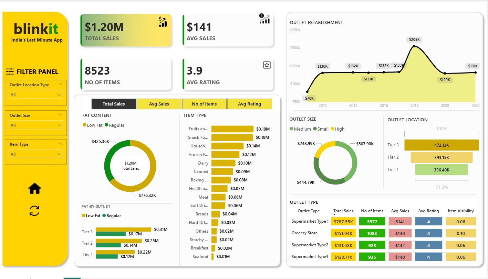

# 🛒 BlinkIT Sales Dashboard

## Project Overview

This project analyzes BlinkIT grocery sales using Excel and Power BI to identify sales performance, customer preferences, and outlet performance.

---

## Tools Used

- Microsoft Excel
- Power BI

---

## Dashboard Features

- Total Sales
- Average Sales
- Number of Items
- Average Rating
- Sales by Outlet Type
- Sales by Outlet Size
- Sales by Item Type
- Sales by Fat Content
- Outlet Establishment Trend

---

## Business Insights

- Identified highest performing outlet types.
- Compared sales across item categories.
- Analyzed customer ratings.
- Evaluated outlet size contribution to sales.

---

## Dashboard Preview

## Files Included

- blinkit.pbix
- BlinkIT Grocery Data.xlsx
- Dashboard.png

